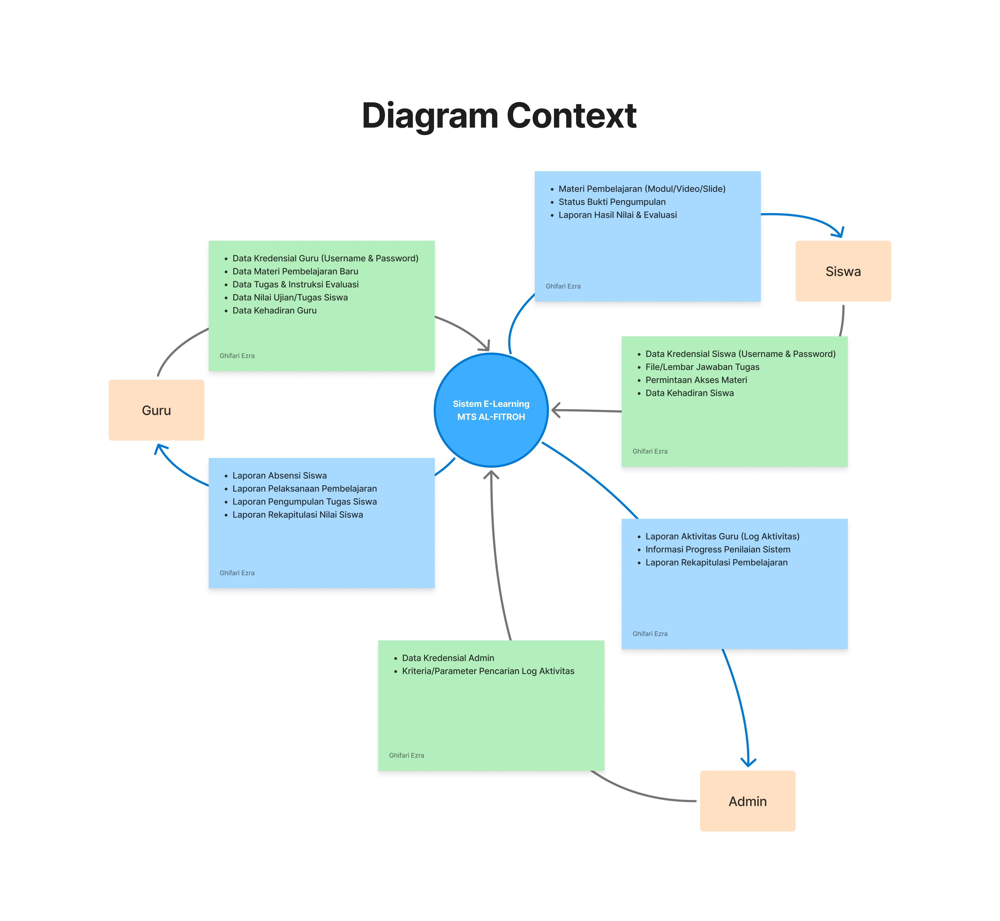
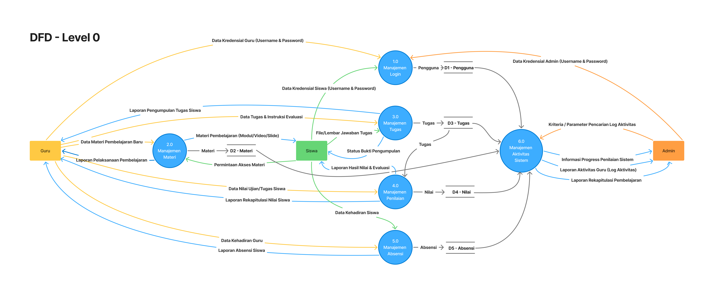
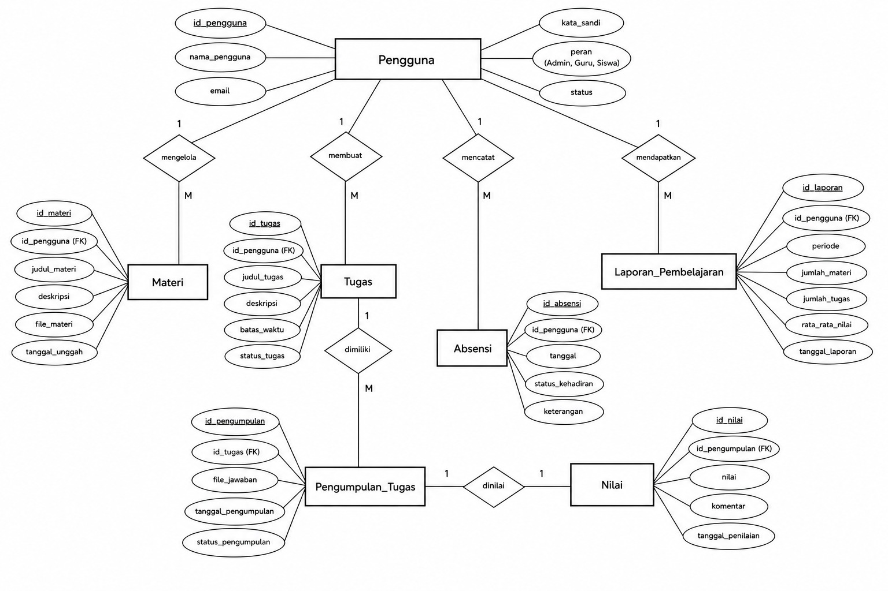
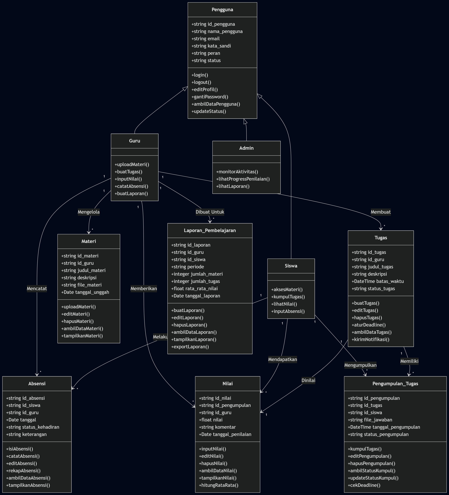

# Rekayasa Perangkat Lunak (RPL)
## Anggota Kelompok 10

| Nama  | NPM |
| ----- | --- |
| Dheka Airlangga  | 452421002 |
| Farhan Ridwan Badhawi  | 4524210037 |
| Ghifari Ezra Ramadhan  | 4524210041 |

# Sistem Informasi Akademik MTs Al-Fitrah

Aplikasi CLI (Command Line Interface) berbasis Java untuk mengelola operasional akademik MTs Al-Fitrah. Sistem ini dibangun dengan prinsip Object-Oriented Programming (OOP), mencakup pembagian peran/akses (RBAC) serta pemanfaatan _interface contracts_ (Abstraksi).

## 🚀 Fitur Utama

- **Sistem Otentikasi Terpusat**: Validasi login dengan format email (Regex) dan transisi status pengguna (Online/Offline).
- **In-Memory Database**: Penggunaan `static List` untuk manipulasi data `Pengguna` dan `Materi` secara *runtime*.
- **Role-Based Access Control (RBAC)**:
  - **Guru**: Memiliki akses ke menu Input Nilai, Buat Tugas, Upload Materi, Buat Laporan, dan Catat Absensi.
  - **Siswa**: Hak akses dan menu khusus siswa (Tahap Pengembangan).
  - **Admin**: Hak akses dan menu khusus admin (Tahap Pengembangan).
- **Manajemen Materi**: Fitur unggah, edit, hapus, serta tampilkan materi yang terintegrasi (CRUD Materi).

## 📂 Struktur Proyek

```text
src/
└── com/
    └── main/
        ├── App.java                  // Entry point aplikasi dan sistem routing (Login & Menu Utama)
        ├── contract/                 // Kumpulan Interface (Abstraksi)
        │   ├── ContractGuru.java
        │   ├── ContractMateri.java
        │   ├── ContractPengguna.java
        │   └── ContractTugas.java
        ├── tasks/                    // Entitas dan logika terkait tugas & materi akademik
        │   ├── Materi.java
        │   └── Tugas.java
        └── users/                    // Entitas aktor pengguna sistem
            ├── Admin.java
            ├── Guru.java
            ├── Pengguna.java         // Abstract class untuk semua entitas aktor
            └── Siswa.java

test/
└── com/
    └── main/
        └── users/                    // Kelas-kelas unit test (JUnit 5)
            ├── GuruTest.java
            ├── PenggunaTest.java
            └── SiswaTest.java
```

## 📊 Diagram Context

## 📊 Data Flow Diagram

## 📊 Entity Relationship Diagram

## 📊 Class Diagram


## 📚 Teknologi & Pola Desain

- **Bahasa:** Java
- **Pengujian:** JUnit 5 Jupiter (Standalone Console Engine)
- **OOP Concepts:**
   - _Inheritance:_ Turunan Pengguna ke kelas Admin, Guru, dan Siswa.
   - _Polymorphism:_ Overriding fungsionalitas login, logout, dan manajemen tugas/materi kontrak.
   - _Abstraction:_ Integrasi antarmuka melalui sub-package contract untuk standarisasi aksi aktor/fitur.
   - _Encapsulation:_ Proteksi atribut menggunakan modifier private dengan interaksi via getter/setter.
- **Validasi Data:** Stream API dan Lambda Expressions untuk pengecekan ekstensi file serta Regex untuk format email.

## 💻 Cara Menjalankan & Menguji (Cross-Platform)
Proyek ini dilengkapi dengan skrip automasi berbasis PowerShell untuk mempermudah proses kompilasi dan eksekusi.

1. Menjalankan Aplikasi Utama
Buka terminal/PowerShell di direktori root proyek, kemudian jalankan skrip automasi berikut:

```Bash
.\scripts\runApp.ps1
```
_Atau lakukan kompilasi manual:_

```Bash
javac -d bin -sourcepath src src/com/main/App.java
java -cp bin com.main.App
```
2. Menjalankan Seluruh Unit Test (JUnit 5)
Untuk memverifikasi fungsionalitas sistem berjalan dengan aman tanpa regresi, eksekusi skrip testing berikut:

```bash
.\scripts\runTest.ps1
```

_Atau lakukan kompilasi dan eksekusi manual:_

```Bash
javac -d bin -cp "bin;lib\junit-platform-console-standalone-1.10.0.jar" test\com\main\users\*.java
java -jar lib\junit-platform-console-standalone-1.10.0.jar -cp bin --scan-classpath
```
**📑 Dokumentasi Skenario Uji (Unit Testing)** 
> Detail lengkap mengenai 19 Test Cases yang diimplementasikan pada sistem ini dapat dilihat melalui tautan berikut:
> 
> 👉 [Lihat Dokumen TEST_CASE.md](docs/TEST_CASE.md)

## 📝 Catatan Penting
Dibuat untuk keperluan manajemen akademik digital lingkungan sekolah.
