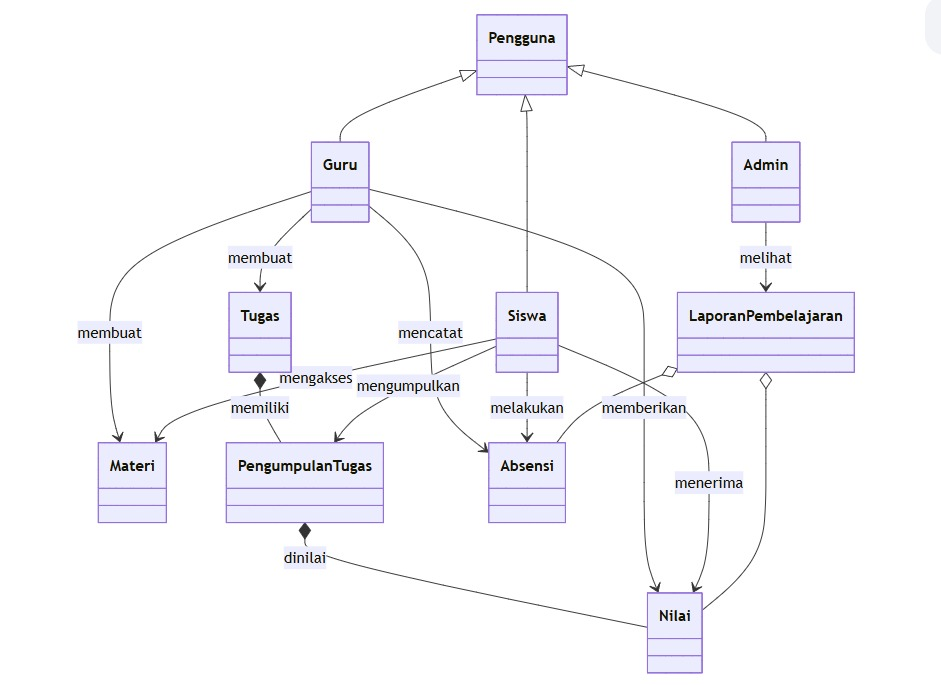

# Rekayasa Perangkat Lunak (RPL)
## Anggota Kelompok 10

| Nama  | NPM |
| ----- | --- |
| Dheka Airlangga  | 452421002 |
| Farhan Ridwan Badhawi  | 452421003 |
| Ghifari Ezra Ramadhan  | 4524210041 |

# Sistem Informasi Akademik MTs Al-Fitrah

Aplikasi CLI (Command Line Interface) berbasis Java untuk mengelola operasional akademik MTs Al-Fitrah. Sistem ini dibangun dengan prinsip Object-Oriented Programming (OOP), mencakup pembagian peran/akses (RBAC) serta pemanfaatan _interface contracts_ (Abstraksi).

## 🚀 Fitur Utama

- **Sistem Otentikasi Terpusat**: Validasi login dengan format email (Regex) dan transisi status pengguna (Online/Offline).
- **In-Memory Database**: Penggunaan `static List` untuk manipulasi data `Pengguna` dan `Materi` secara *runtime*.
- **Role-Based Access Control (RBAC)**:
  - **Guru**: Memiliki akses ke menu Input Nilai, Buat Tugas, Upload Materi, Buat Laporan, dan Catat Absensi.
  - **Siswa**: Hak akses dan menu khusus siswa (Tahap Pengembangan).
  - **Admin**: Hak akses dan menu khusus admin (Tahap Pengembangan).
- **Manajemen Materi**: Fitur unggah, edit, hapus, serta tampilkan materi yang terintegrasi (CRUD Materi).

## 📂 Struktur Proyek

```text
src/
 └── com/
      └── main/
           ├── App.java          // Entry point aplikasi dan sistem routing (Login & Menu Utama)
           ├── Pengguna.java     // Abstract class untuk semua entitas aktor
           ├── Admin.java        // Entitas Admin turunan dari Pengguna
           ├── Guru.java         // Entitas Guru turunan dari Pengguna
           ├── Siswa.java        // Entitas Siswa turunan dari Pengguna
           ├── Materi.java       // Entitas Materi pelajaran
           └── contract/         // Kumpulan Interface (Abstraksi)
                ├── ContractPengguna.java
                ├── ContractGuru.java
                └── ContractMateri.java
```

## 📊 Class Diagram



## 📚 Teknologi & Pola Desain

- **Bahasa**: Java 
- **OOP Concepts**: *Inheritance* (Turunan `Pengguna`), *Polymorphism* (Overriding method login, dll.), *Abstraction* (Penggunaan Interface / Contract).
- **Validasi**: RegEx API untuk verifikasi email saat proses otentikasi.

## 💻 Cara Menjalankan

1. Pastikan Anda memiliki **JDK (Java Development Kit)** terinstal di mesin Anda.
2. Buka proyek ini menggunakan Visual Studio Code atau IDE Java favorit Anda (seperti IntelliJ / Eclipse).
3. Jalankan file utama: `src/com/main/App.java` (Klik Kanan -> Run Java).
4. Gunakan kredensial Dummy (contoh untuk login guru):
   - **Email**: `naila@mts.com` atau `maghfiroh@mts.com`
   - **Password**: `guru123`

---
*Dibuat untuk keperluan manajemen akademik digital lingkungan sekolah.*
